# The analysis of falling data of accelerometer
Data are collected from the IMU, **LSM6DS3TR-C** installed within seeed XIAO nRf52840. The sum of square equation will be used on the 3 axis acceleration to obtain the resultant acceleration vector for the analysis. 

```
Norm = SQRT(ACCEL_X**2 + ACCEL_Y**2 + ACCEL_Z**2);
```

## Overview of data retrieved

**Legend**
1) Walking
2) Walking Up and Down Stairs
3) Dropping of IMU
4) Sitting and Standing up from plastic chair
5) Shaking of IMU
6) Falling from the chair
7) Fall forward

**Note**
1) The device designed to be used as a keychain, thus the device is placed in the back pocket of our pants during data collection.
2) The shaking of IMU is recorded with it held on the hand.

With that we will include the rate of change in acceleration, the second derivative in the rate of change in acceleration, and moving average of a window of 50 data point,


A few highest rate of change of acceleration will be recorded for analysis.

## Analysing **Walking**

**Zooming in:**\

**Note**
1) Random points:

|point| Norm | f'(x) | f''(x) |
|-----|------|-------|--------|
|2101| 0.85        | 0.336068328 | 0.00305213  |
|2202| 1.25876924  | 0.271906121 | 0.003399633 |
|2325| 1.393448959 | 0.397809776 | 0.003501889 |

## Analysing **Stairs**

From the graph we could observe two different section where the norm acceleration for going up the stairs is way lower than going down the stairs. Thus, we will analyse the going down of stairs instead. 
**Legend**
1) Walking up then down the stairs
2) Limping up then down the stairs
3) Limping up then down the stairs (Other Leg)
4) Running up then down the stairs

### Walking up then down the stairs

**Note**
|point| Norm | f'(x) | f''(x) |
|-----|------|-------|--------|
|26704| 0.595399026 | 1.453343034 | 0.015052862 |
|26900| 0.672978454 | 1.922880154 | 0.017114909 |
|27242| 0.904488806 | 0.175432193 | 0.00063385  |

### Limping up and then down the stairs

**Note**
|point| Norm | f'(x) | f''(x) |
|-----|------|-------|--------|
|34018| 5.320620265 | 2.319318931 | 0.034806461 |
|34223| 6.612503308 | 2.080303042 | 0.028609112 |
|34375| 4.503987123 | 1.345020579 | 0.015369838 |

### Limping up and then down the stairs (Other Leg)
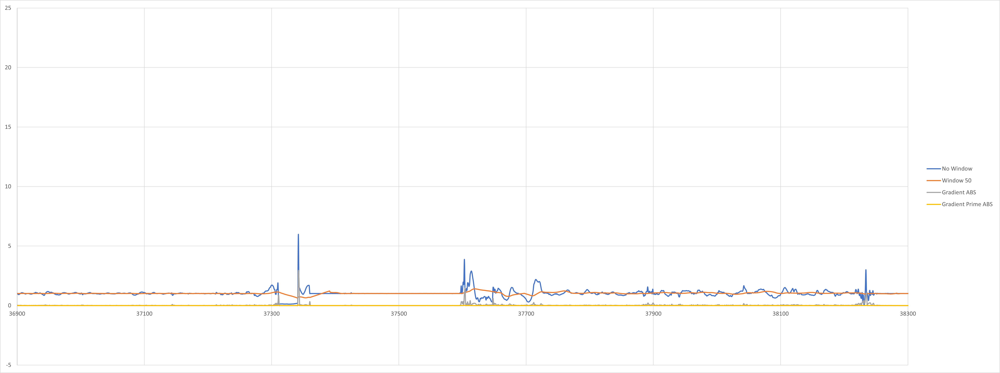
**Note**
|point| Norm | f'(x) | f''(x) |
|-----|------|-------|--------|
|37342| 5.97850316 | 2.89438325 | 0.05089264  |
|37604| 1.0177426  | 1.427956   | 0.014744675 |
|38234| 3.00627677 | 0.90062282 | 0.019383044 |

**Most Significant Detection**
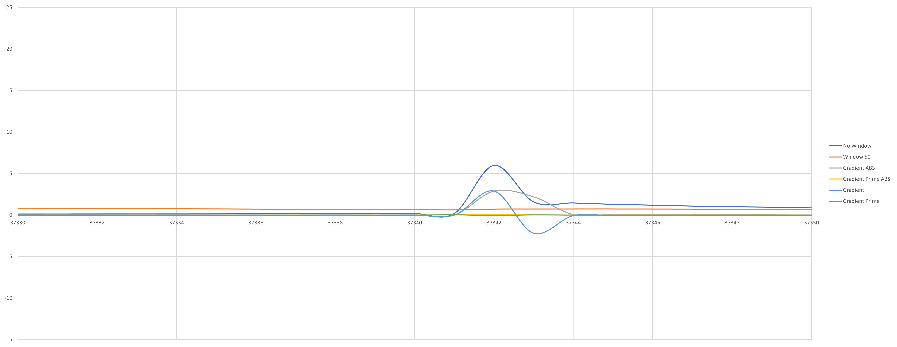

Gradient:  
Max = 2.894383249  
Min = -2.194880759  
*Max Gradient More Than 50 Mean, 0.720361147*

### Running up and then down the stairs
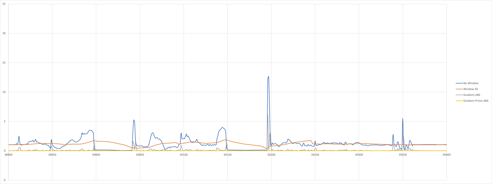
**Note**
|point| Norm | f'(x) | f''(x) |
|-----|------|-------|--------|
|39196| 12.2078213 | 6.03987939 | 0.058243241 |
|39199| 1.4169686  | 0.01073792 | 0.000376615 |
|39350| 5.46485133 | 2.64582312 | 0.050280346 |

**Most Significant Detection**
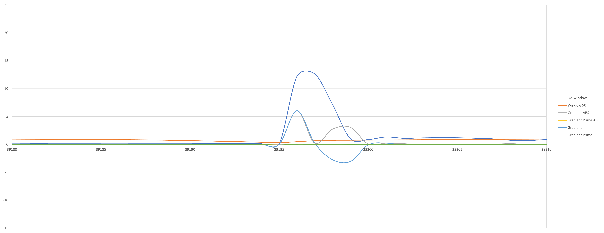

Gradient:  
Max = 1.713900863  
Min = -1.406512019  
*Max Gradient More Than 50 Mean, 0.485567491*

### Dropping of IMU
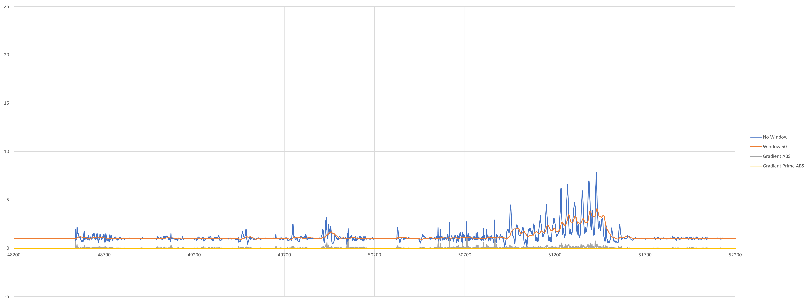
**Note**
|point| Norm | f'(x) | f''(x) |
|-----|------|-------|--------|
|50867| 2.93165482 | 0.84010783 | 0.018871274 |
|51271| 6.60540688 | 0.07334979 | 0.003136808 |
|51429| 7.66756806 | 0.42955872 | 0.003312123 |

### Sitting and standing from plastic chair
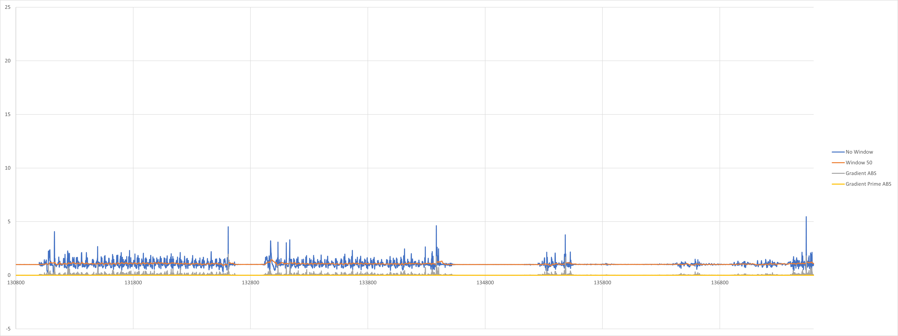
**Note**
|point| Norm | f'(x) | f''(x) |
|-----|------|-------|--------|
|124418| 1.3924439  | 1.67057441 | 0.016458247 |
|127650| 7.57681331 | 2.39403404 | 0.04951892  |
|128489| 6.39746043 | 2.56434075 | 0.050413023 |
|128490| 1.44353732 | 2.47696156 | 0.02131954  |

**Most Significant Detection**
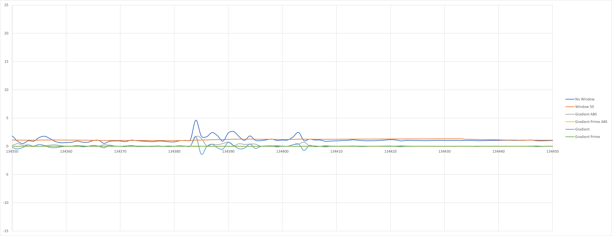

### Shaking of IMU
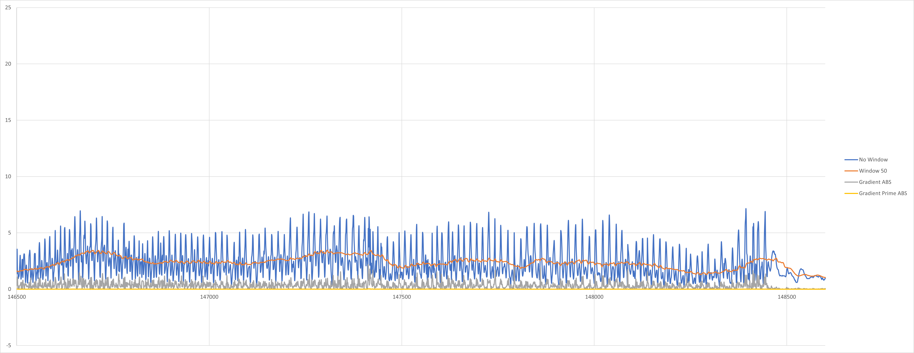
**Note**
|point| Norm | f'(x) | f''(x) |
|-----|------|-------|--------|
|147413| 5.33691859 | 2.18263525 | 0.02974069 |
|148087| 3.92880389 | 1.74343815 | 0.019434068|
|148412| 5.50270842 | 1.65809075 | 0.018426668|

**Most Significant Detection**
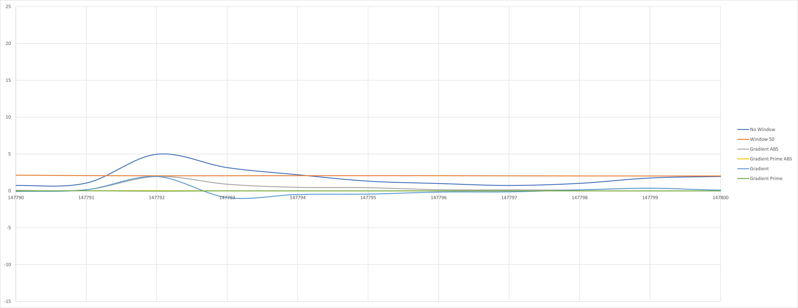

Gradient:  
Max = 1.713900863  
Min = -1.406512019  
*Max Gradient More Than 50 Mean, 1.084352*


### Falling
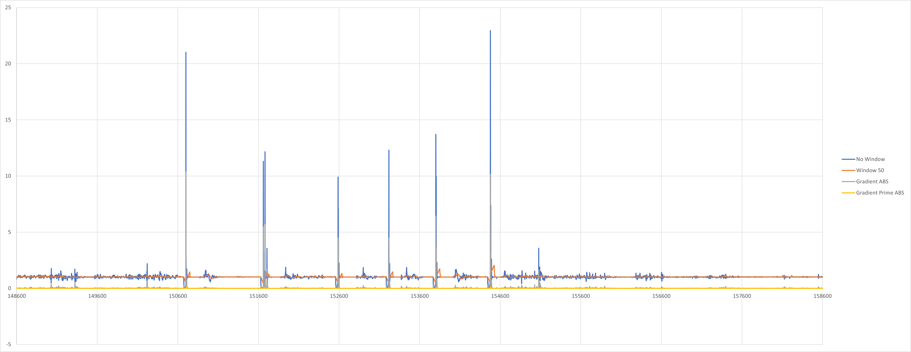
**Note**
|point| Norm | f'(x) | f''(x) |
|-----|------|-------|--------|
|150700| 21.0203187 | 10.2686019 | 0.19819152 |
|151661| 11.0312737 | 5.46538749 | 0.07213993 |
|151682| 12.1636426 | 5.63318495 | 0.108593481|
|152588| 9.91117047 | 4.42504366 | 0.082039699|
|153219| 12.2903051 | 3.57987967 | 0.080156318|
|153220| 3.41880096 | 4.43575208 | 0.037172477|
|153801| 13.5009852 | 6.39711601 | 0.090973936|
|154478| 22.5853692 | 10.1236572 | 0.140823507|

**Insignificant Detection**
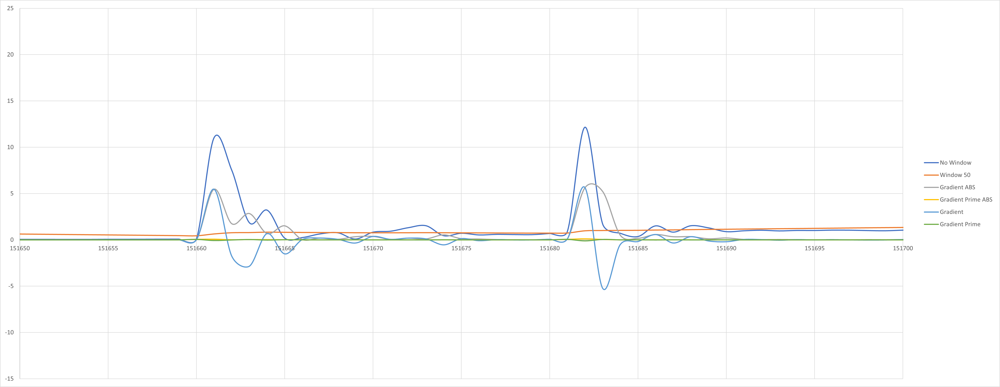

Gradient:  
Max = 1.954421754  
Min = -0.48353773  
*Max Gradient Lower than 50 Mean*

### Falling Forward
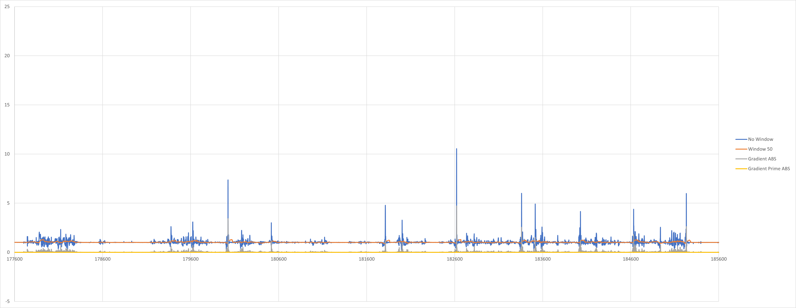
**Note**
|point| Norm | f'(x) | f''(x) |
|-----|------|-------|--------|
|180025| 7.3281495  | 3.38140316 | 0.053954091|
|181812| 4.75042103 | 1.17818295 | 0.014426057|
|182622| 10.5353643 | 3.69902825 | 0.083047814|
|182623| 1.323858   | 4.60575313 | 0.043626618|
|183360| 5.94348383 | 2.53134437 | 0.037461287|
|183515| 4.87521282 | 1.51486592 | 0.022030153|
|184633| 4.35516934 | 1.79035089 | 0.026907707|
|185232| 5.98194784 | 2.56913272 | 0.046908972|

**Insignificant Detection**
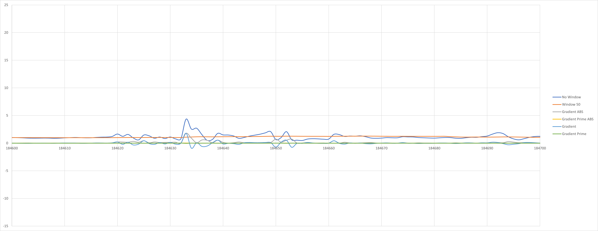

### Summaries Data
|Type|point| Norm | f'(x) | f''(x) |
|----|-----|------|-------|--------|
|1|2101| 0.85        | 0.336068328 | 0.00305213  |
|1|2202| 1.25876924  | 0.271906121 | 0.003399633 |
|1|2325| 1.393448959 | 0.397809776 | 0.003501889 |
|2.1|26704| 0.595399026 | 1.453343034 | 0.015052862 |
|2.1|26900| 0.672978454 | 1.922880154 | 0.017114909 |
|2.1|27242| 0.904488806 | 0.175432193 | 0.00063385  |
|2.2|34018| 5.320620265 | 2.319318931 | 0.034806461 |
|2.2|34223| 6.612503308 | 2.080303042 | 0.028609112 |
|2.2|34375| 4.503987123 | 1.345020579 | 0.015369838 |
|2.3|37342| 5.97850316 | 2.89438325 | 0.05089264  |
|2.3|37604| 1.0177426  | 1.427956   | 0.014744675 |
|2.3|38234| 3.00627677 | 0.90062282 | 0.019383044 |
|2.4|39196| 12.2078213 | 6.03987939 | 0.058243241 |
|2.4|39199| 1.4169686  | 0.01073792 | 0.000376615 |
|2.4|39350| 5.46485133 | 2.64582312 | 0.050280346 |
|3|50867| 2.93165482 | 0.84010783 | 0.018871274 |
|3|51271| 6.60540688 | 0.07334979 | 0.003136808 |
|3|51429| 7.66756806 | 0.42955872 | 0.003312123 |
|4|124418| 1.3924439  | 1.67057441 | 0.016458247 |
|4|127650| 7.57681331 | 2.39403404 | 0.04951892  |
|4|128489| 6.39746043 | 2.56434075 | 0.050413023 |
|4|128490| 1.44353732 | 2.47696156 | 0.02131954  |
|5|147413| 5.33691859 | 2.18263525 | 0.02974069 |
|5|148087| 3.92880389 | 1.74343815 | 0.019434068|
|5|148412| 5.50270842 | 1.65809075 | 0.018426668|
|6|150700| 21.0203187 | 10.2686019 | 0.19819152 |
|6|151661| 11.0312737 | 5.46538749 | 0.07213993 |
|6|151682| 12.1636426 | 5.63318495 | 0.108593481|
|6|152588| 9.91117047 | 4.42504366 | 0.082039699|
|6|153219| 12.2903051 | 3.57987967 | 0.080156318|
|6|153220| 3.41880096 | 4.43575208 | 0.037172477|
|6|153801| 13.5009852 | 6.39711601 | 0.090973936|
|6|154478| 22.5853692 | 10.1236572 | 0.140823507|
|7|180025| 7.3281495  | 3.38140316 | 0.053954091|
|7|181812| 4.75042103 | 1.17818295 | 0.014426057|
|7|182622| 10.5353643 | 3.69902825 | 0.083047814|
|7|182623| 1.323858   | 4.60575313 | 0.043626618|
|7|183360| 5.94348383 | 2.53134437 | 0.037461287|
|7|183515| 4.87521282 | 1.51486592 | 0.022030153|
|7|184633| 4.35516934 | 1.79035089 | 0.026907707|
|7|185232| 5.98194784 | 2.56913272 | 0.046908972|

From the above data we can denote the following

|Non-Falling|Norm|f'(x)|f''(x)|
|-------|----|-----|------|
|Min|0.595399026|0.01073792|0.000376615|
|Max|12.2078213|6.03987939|0.058243241|

|Falling|Norm|f'(x)|f''(x)|
|-------|----|-----|------|
|Min|1.323858|1.17818295|0.014426057|
|Max|22.5853692|10.2686019|0.19819152|

From the data we can assume the following:
1) If f''(x) is > 0.06, we could say that a fall occur.
2) For f'(x) > 1.178, we will need a second verification.
3) For f(x) > 1.323, we will need a second verificaiton.